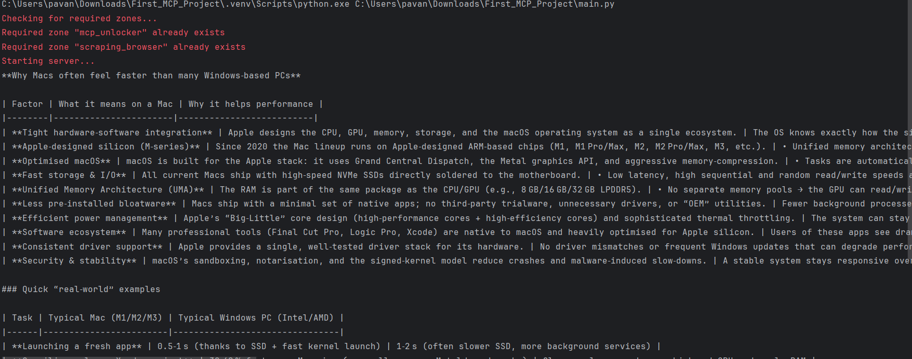

Your App (main.py — user input/output, workflow)

└──► Agent (LangGraph + LLM)

                • Thinks / reasons  
                • Decides which tool to call  
            
└──► MCP Client (MultiServerMCPClient)

                • Bridge between Agent ↔ MCP Server(s)
                • Knows where servers are, how to talk
                • Example: connects to Bright Data MCP

└──► MCP Server (e.g., Bright Data MCP)

                • Hosts real tools  
                • Example: fetch_html, scrape_site, proxy  
                • Executes requests and returns results

Output:

Flow-------------------------------------

**User Input**

    A user enters a natural-language query, for example:

    “What’s the weather in London right now?”

**LangGraph Agent**

    The query is passed to the LangGraph agent, which coordinates all reasoning steps.

    The agent sends the message to the underlying LLM (Groq Llama 3) for initial analysis.

**LLM Reasoning**

    The model determines whether it already knows the answer or needs to call an external tool.

    If tool use is required, the model instructs the agent to invoke a specific tool (e.g., Bright Data).

**MCP Client Communication**

    The agent uses the MultiServerMCPClient to route this tool call.

    The client launches or connects to the appropriate MCP server instance.

**Bright Data MCP Server**

    The MCP server receives the tool request over stdio transport.

    Using the Bright Data API credentials (BRIGHT_DATA_TOKEN and BROWSER_ZONE), it performs the required web-scraping or data-fetch action.

    The MCP server returns structured JSON output to the MCP client.

**Tool Result Integration**

    The MCP client passes the result back to the LangGraph agent.

    The agent forwards that data to the LLM, asking it to integrate the information into a natural-language answer.

**Final LLM Response**

    The model synthesizes the final response (combining its reasoning + tool output).

    The agent returns this formatted message to the calling application.

**User Output**

    The application displays or prints the LLM’s final answer.

Useful links:
grog - https://console.groq.com/home

Bright Data - https://brightdata.com/

Bright Data Github - https://github.com/brightdata/brightdata-mcp

LangGraph Documentation to create agent - https://langchain-ai.github.io/langgraph/agents/agents/

LangChain MCP Adapters GitHub - https://github.com/langchain-ai/langchain-mcp-adapters

